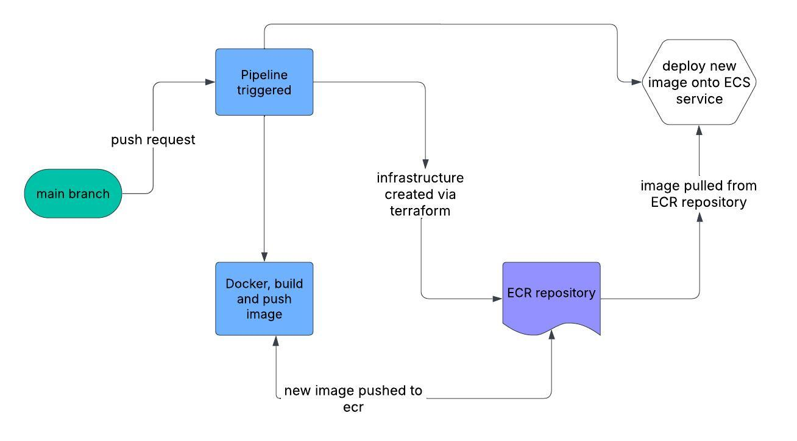

# AWS ECS Terraform CI/CD Project

 

## 🚀 Project Overview
This project provisions an AWS ECS cluster using Terraform and sets up a CI/CD pipeline to automate infrastructure and container deployment. The goal is to create a scalable containerized application environment using ECS without Fargate, ECR, ASG, VPC, and security groups.

  ### Key Features:
    ✅ ECS Cluster with EC2 instances (no Fargate)
    ✅ CI/CD pipeline to provision infrastructure and deploy containers
    ✅ Terraform modules for infrastructure setup
    ✅ Automatic task definition updates with Docker image builds
    ✅ Accessible via AWS-provided domain

## 🏗️ Built With
  Terraform – Infrastructure as Code
  AWS ECS – Elastic Container Service
  AWS ECR – Elastic Container Registry
  GitHub Actions – CI/CD
  Docker – Containerization

## 🚦 Getting Started
 ### Prerequisites
  - AWS account with proper permissions
  - Terraform installed (>= 1.0)
  - GitHub repository with GitHub Actions enabled
   - Installation
    - Clone the repo:
      Use  `git clone https://github.com/your-username/your-repo.git`
        
  - Configure AWS credentials and Terraform variables in variables.tf
  - Configure ECR repo name to match deploy.yml
  - Run CI/CD pipeline to provision infrastructure and deploy the container

## 📦 Deployment Process
  - CI/CD pipeline triggers terraform init and terraform apply to provision ECS, ECR, and other resources
  - Docker container is built, tagged, and pushed to ECR
  - Task definition is updated automatically
  - Application becomes accessible via AWS-provided domain

## ⚙️ Configuration
  ### variables.tf	
  >Define AWS region, ECR repo name, and infrastructure settings
 ### deploy.yml	
 >CI/CD workflow configuration
  ### main.tf	
  >Terraform root module
  ### .app/	
  >Directory for application code

## 🛡️ Security
  AWS credentials are stored securely using GitHub secrets
  Security groups configured to restrict access

## 💡 Troubleshooting
  If ECS task fails, check AWS console logs
  Ensure ECR repo name matches in variables.tf and deploy.yml
  Confirm AWS credentials are correctly configured

## 🗺️ Roadmap
  Add support for multi-region deployment
  Automate secret rotation
  Add monitoring and logging

 
## 🙌 Contributing
  Fork the repo
  Create a feature branch (git checkout -b feature/your-feature)
  Commit changes (git commit -m 'Add feature')
  Push to branch (git push origin feature/your-feature)
  Open a pull request
## 📝 License
  Distributed under the MIT License. See LICENSE for details.

## 📞 Contact
  Abdulrahman Said – www.linkedin.com/in/abdulrahman-said-4557a3236

